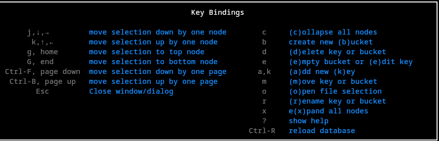
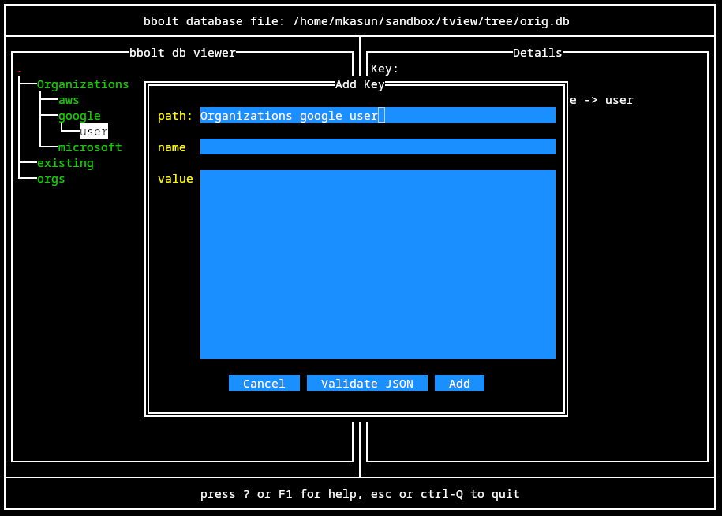
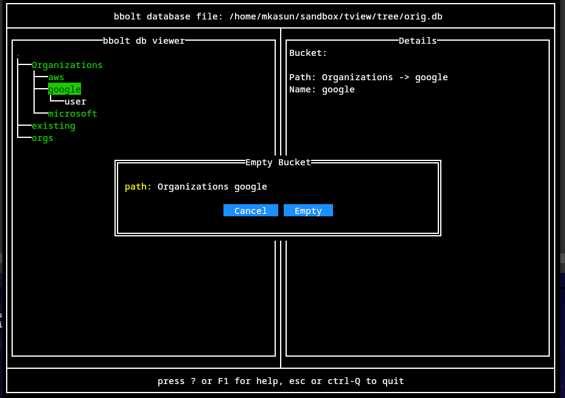

# bboltEdit

bboltEdit is a tool to view and edit [bbolt](https://github.com/etcd-io/bbolt) database files

## Overview

### Startup

bboltEdit will open test.db in the current directory or database file passed as parameter  
If database file does not exist, it is created  
A log file is created in the TEMP dir and main window is displayed  
The left pane displays a tree view of the database and the right pane displays

### Operations

#### Movement

use to movement keys to traverse the database tree.  Details of the bucket key will be displayed in the details page.  Key values will be displayed in json format if applicable

#### Creeat New Bucket

press b to open create bucket dialog

to create a root bucket leave the parent bucket field blank  
upon submit, buckets in the parent path (if not already existing) and the new bucket will be created.  
An invalid bucket path (eg. contains a key name) will generate an error dialog

#### Create Key

press a to open new key dialog

a new key will be created with the path/name specified in the fields  
all buckets in the path will be created if not already existing. the path must contain at least one bucket  

if the key value is valid json, the value will be stored as normalized json (extra whitespace removed).  Non json values will be saved as entered in the value field  

the validate json button will indicate whether the value is valid json by changine the border of the dialog green or red

#### Rename key or bucket

press r to open rename dialog

the key or bucket will be renamed

#### Empty Bucket

press e with bucket selected in database tree to open empty bucket dialog

delete all keys and buckets in the selected bucket  
the selected bucket will not be deleted

#### Delete Key or Bucket

press d to open delete dialog

deletes the selected key or bucket 

#### Move Key or Bucket

press m to open move dialog

move the key or bucket from the current path to the new path.  All buckets in the new path will be created if not already existing.  

if the new bucket or key name (last entry in new path) is not the same as the current name, the key/bucket is first renamed and then moved. An error will be generated if any existing bucket key exists.  In these case, move the key/bucket will the old name and then rename.

#### Open database

pressing open key will open file tree to select a new database to view edit

enter key will open directory or select file to be opened. An error will be displayed if the selected file is not a bbolt database

the o key will open a dialog to change the directory search path

